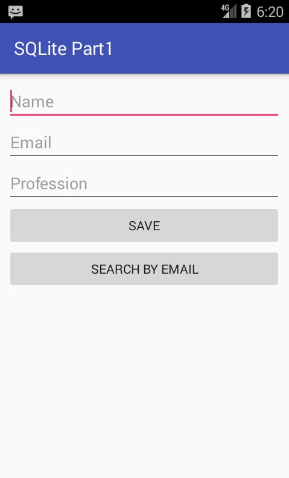
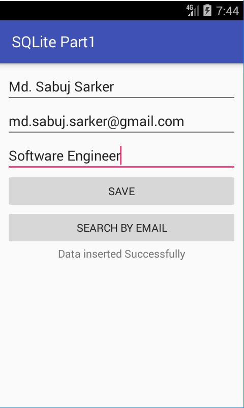
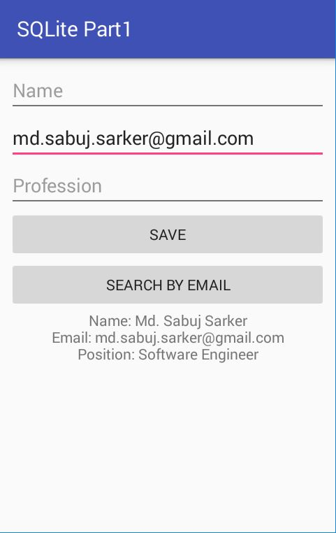

# People Store - An Android Application
I started developing this application for providing lessons on developing android application that need to interact with database, content providers/reslvers, network, etc. In the long run it may or may not result into a full android application. Currently this application is a part of a series of articles written by me to teach the world android programming.

## Few Screenshots (Related To Interface And SQLite)

Main Activity Initial Screen:

Insertion Success:

Search Success:

